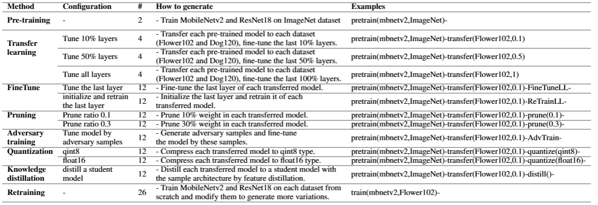

This benchmark references the following repository：[yuanchun-li/ModelDiff](https://github.com/yuanchun-li/ModelDiff)

## Description of Benchmark

In this benchmark, we maintain the model structures used in the original benchmark, namely MobileNetv2 and ResNet18, as well as the dataset: Oxford Flowers 102, Stanford Dogs 120 and ImageNet. As presented in Table, the benchmark now encompasses a total of 136 models. Among these, there are 2 pretrained models that have been trained using the ImageNet dataset. Additionally, there are 108 lineage models derived from the pretrained models. These lineage models consist of 12 transferred models, 24 fine-tuned models, 24 pruned models, 12 adversary trained models, 24 quantized models, and 12 distilled models. Each lineage model is constructed based on one of the transferred models, employing different modification techniques as described in the "Configuration" column of Tab. Furthermore, there are 26 retrained models that have been trained from scratch.

## How to get the benchmark

You can download the benchmark from this URL: https://drive.google.com/file/d/15sI7sLGZJ34if9p8cezcx6OzYQnpsA1O/view?usp=sharing

## How to get the dataset

You can download the dataset (only conclude Flower102 and SDog120) from this URL: https://drive.google.com/file/d/1pg8salejyLEpsukDj10y99_UTpWjQ3c9/view?usp=sharing

Alternatively, you can google the name of the dataset and download them.
