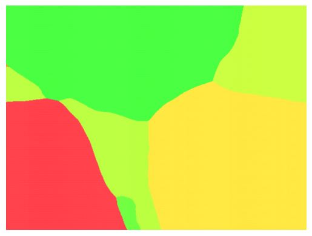

This code is modified from the repository: [somepago/dbViz: The official PyTorch implementation - Can Neural Nets Learn the Same Model Twice? Investigating Reproducibility and Double Descent from the Decision Boundary Perspective (CVPR'22).](https://github.com/somepago/dbViz).

Please refer to the above repository for the specific configuration required to run the code.

Before running this code, you need to configure

1. line 35 in main.py. Specify a good dataset, currently only the Flower102 and Sdog120 datasets are supported.
2. line 40 in main.py. Specify the model, currently only resnet18 and mobilnetv2 structures are supported.
3. line 40 in main.py. Specify the model, currently only resnet18 and mobilnetv2 structures are supported.

The code run configuration can be configured by adjusting option.py.

One of the main things to adjust is line 55, which adjusts the three images selected for visualisation. The principle of visualisation is to take the three images, determine a plane, and then visualise this decision plane, as described in the original paper and code. Therefore, the output of these three images cannot be the same.

An example of a visualization result：

